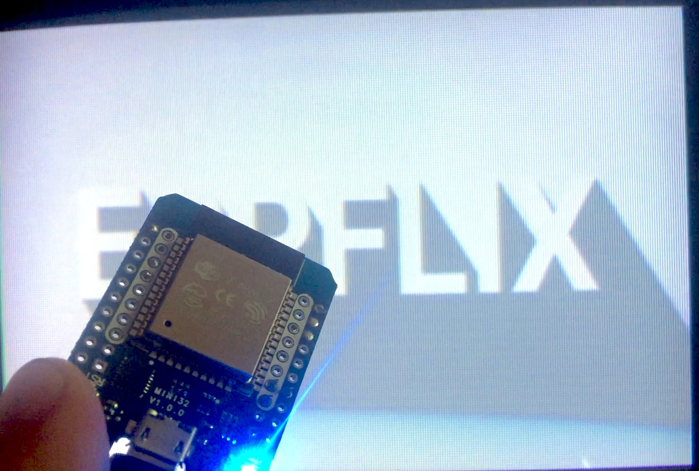
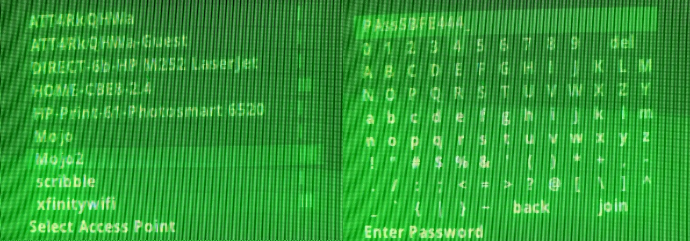
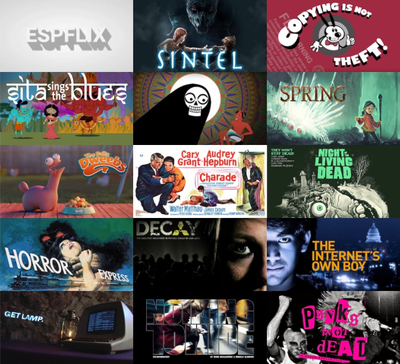
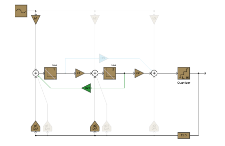
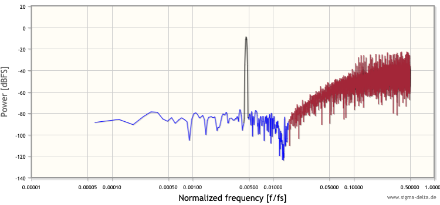

# ESPFLIX: A free video streaming service that runs on a ESP32

### Find yourself stuck indoors during a pandemic? Why not build an open source settop box and connect to the only microcontroller powered video streaming service?
See it in action on [YouTube](https://youtu.be/oPL8Pj6ATrg). Source at [https://github.com/rossumur/espflix](https://github.com/rossumur/espflix).



**ESPFLIX** is designed to run on the ESP32 within the Arduino IDE framework. Like the [ESP_8_BIT](https://rossumblog.com/2020/05/10/130/), the schematic is pretty simple:

```
    -----------
    |         |
    |      25 |------------------> video out
    |         |
    |      18 |---/\/\/\/----|---> audio out
    |         |     1k       |
    |         |             ---
    |  ESP32  |             --- 10nf
    |         |              |
    |         |              v gnd
    |         |
    |         |     3.3v <--+-+   IR Receiver
    |         |      gnd <--|  )  TSOP4838 etc.
    |       0 |-------------+-+       -> AppleTV remote control
    -----------

```

You will also need an AppleTV remote control or similar. Lots of compatible remotes on ebay for a few dollars. It is pretty easy to adapt other remotes, see ```ir_input.h``` for details.

On first boot select a WiFi access point and enter a password. If you need to change the access point at a later time hold the **menu** key during the splash screen to return to the access point selection screen.



Once in the top level menu scroll left and right to select something to watch. When in playback **left** and **right** on the remote will fast forward / rewind. **up** and **down** will skip forward and back by 30 seconds. **menu** will save the position of the current content and return you to the selection screen.

# New this month on ESPFLIX


Ok, so it is a slightly smaller collection than Netflix but still stuff that is funny/enjoyable/interesting. Big shout out to the brilliant Nina Paley for all her great work.


# How It Works
Building on the NTSC/PAL software video output created for [ESP_8_BIT](https://rossumblog.com/2020/05/10/130/), ESPFLIX adds video and audio codecs and a AWS streaming service to deliver a open source pastiche of Netflix.

## MPEG1 Software Video Codec
In 1993, [Compact Disc Digital Video](https://en.wikipedia.org/wiki/Video_CD) was introduced. Using the MPEG1 video codec, it squeezed 74 minutes onto a CD. Earlier that year the Voyager Company had used Quicktime and the [Cinepak](https://en.wikipedia.org/wiki/Cinepak) software codec to produce the first movie ever to be released on CD-ROM: [The Beatle's *Hard Days Night.*](https://www.nytimes.com/1993/04/13/science/personal-computers-at-last-a-movie-fits-on-a-cd-rom-disk.html)

While codecs have improved in the intervening decades the MPEG1 codec uses many of the same techniques as modern codecs: transform coding, motion estimation and variable length coding of prediction residuals are still the foundations of modern codecs like H264.

The standard MPEG1 resolution of 352x240 (NTSC) or 352x288 (PAL) seems like a good match for our ESP32 video output resolution. Because MPEG1 can encode differences between frames (predicted or "P" frames) you need 2 frame buffers at this resolution. MPEG1 normally also encodes differences between past and *future* frames (bidirectionally predicted or "B" frames) so that means 3 buffers.

A quick bit of math on the size of these frame buffers (each encoded in YUV 4:1:1 color space) yields ```352 * 288 * 3 * 1.5 = 456192``` which much more memory than the ESP32 has to offer. So we need to make a few concessions. We can live without B frames: they improve overall coding performance but it is easy to create nice looking video without them. We can also reduce the vertical resolution: 1993 was still a 4:3 world, 352x192 is a fine aspect ratio for the 2020s.

Even though ```352 * 192 * 2 * 1.5 = 202752``` seems a lot more manageable getting a MPEG1 software codec be performant still has its challenges. You can't just ```malloc``` contiguous buffers of that size in one piece on an ESP32. They need to be broken up into strips and all the guts of the codec that does fiddly half-pixel motion compensation has to be adjusted according. Much of this memory needs to be allocated from a pool that can only be addressed 32 bits at a time, further complicating code that needs to run as fast as possible. If the implementation of the MPEG1 decoder looks weird it is normally because it is trying to deal with aligned access and chunked allocation of the frame buffers.

## SBC Software Audio Codec
SBC is a low-complexity subband codec specified by the Bluetooth Special Interest Group (SIG) for the Advanced Audio Distribution Profile (A2DP). Unlike the MP2 codec typically used along side MPEG1 video, SBC uses tiny 128 sample buffers (as opposed to 1152 for MP2). That may not sound like much but with so little memory available it made the world of difference.

I originally wrote this implementation for a Cortex M0: it works fine on that tiny device with limited memory and no hardware divider. Its low complexity is handy given the SBC audio codec runs on core 1 of the ESP32 alongside the video NTSC/PAL encoding, the IP stack and the Delta-Sigma modulator.

## Delta-Sigma (ΔΣ; or Sigma-Delta, ΣΔ) Modulators
I love Delta-Sigma modulators. Despite the vigorous debate over the [correct name ordinality](https://www.laphamsquarterly.org/rivalry-feud/crack) they are a versatile tool that can be used for both high performance [ADCs](https://hackaday.com/2016/07/07/tearing-into-delta-sigma-adcs-part-1/) and [DACs](https://en.wikipedia.org/wiki/Direct_Stream_Digital). A great introduction can be found at https://www.beis.de/Elektronik/DeltaSigma/DeltaSigma.html.

The ESP32 has one built into I2S0. Sadly we are using I2S0 for video generation, so we will have to generate our signal in software. To turn a 48khz, 16 bit mono PCM stream into oversampled single bit stream we will have to choose a modulator that has nice noise characteristics but is fast enough to run on already busy microcontroller.

For this design I settled on a second order cascade-of-resonators, feedback form (CRFB) delta sigma modulator running at a 32x oversample rate. 32x is normally lower than one would like (64x is more typical) but given the already tight constraints on buffering and compute it seemed like a fair tradeoff. The noise shaping is good enough to shove the quantization energy higher in the spectrum allowing the RC filter on the audio pin to do its job efficiently. For each 16 bit PCM sample we produce 32 bits that we jam into the I2S peripheral as if it were a 48khz stereo PCM stream. The resulting 1.5Mbit modulated signal sounds pretty nice once filtered.

Turns out most TVs have filtering built in, directly connecting the digital audio out pin without the RC filter will normally sound fine, just don't look at it on a scope.

I used the great tool hosted at the University of Ulm to design the filter and calculate coefficients to get the desired noise shaping characteristics: https://www.sigma-delta.de/  

  
*Fig.1 CRFB 2nd Order Delta Sigma Modulator*

  
*Fig.2 Noise shaping pushes quantization errors to higher frequencies*

## Displaying Video
Video display is similar to the [ESP_8_BIT](https://rossumblog.com/2020/05/10/130/) although there are a few differences. Because we have 2 frame buffers we can display one while drawing the other, or we can smoothly scroll between them during vertical blanking.

It is worth noting the DAC used to display video is 8 bit / 3.3V. We only use enough bits to get the ~1V range required for video. A voltage divider would allow us more dynamic range on the video but would require a little more assembly. At some point I will add an option to get slightly better video quality using this method.

## Streaming
This all depends on the fantastic AWS infrastructure. Because we are so tight on memory (~10k left once video is running) we don't have a lot of memory for buffering. Netflix uses many megabytes of buffering, MPEG1 systems like VideoCD needed a minimum of ~50k, we have all of **6k** at our disposal. The LWIP stack that the ESP32 uses is not really optimized for streaming media. If the servers are sufficiently far way the TCP AIMD algorithm never has a chance to open the window enough to get reasonable throughput. To overcome this limitation I will offer the service through AWS Cloudfront to try and optimize the experience of those fiddling with it for as long as I can afford it.

The video files themselves are encoded with ```ffmpeg``` at around 1.5MBits. Rate control models / multiplexer don't really work with tiny buffers so your mileage may vary. Although everything is out of spec for the most part audio and video show up at roughly the right time.

The system also produces **trick mode** streams for smooth fast forward and rewind plus an index that allows mapping of time from one stream to another. This index can't fit in memory but by using http range requests we can lookup any slice of the index without loading the whole thing.

## Enjoy

The ESP32 is a great little device. Kind of amazing you can create a settop box for less than the price of a remote control and that platforms like AWS enable a streaming service like this for very little time/money.

cheers,
Rossum

rossumblog.com
